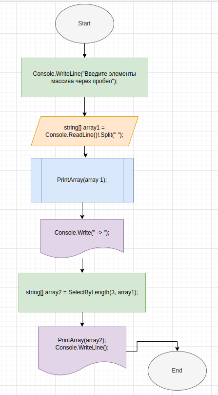
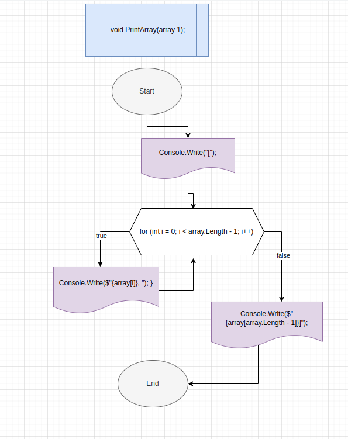
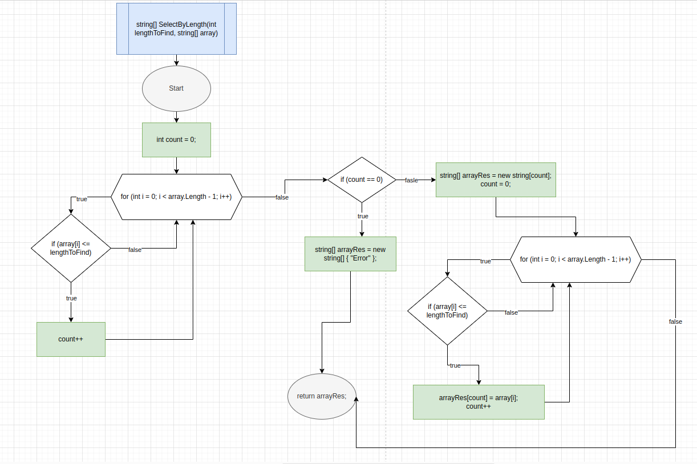

# Итоговая работа по вводному блоку обучения.

## Задача:
Написать программу, которая из имеющегося массива строк формирует массив из строк, длина которых меньше или равна 3 символа. Первоначальный массив можно ввести с клавиатуры, либо задать на старте выполнения алгоритма. При решении не рекомендуется использовать коллекции, только массивы.

```
[”hello”, “2”, “world”, “:-)”] →[”2”, “:-)”]
```

## Решение:
Для решения данной задачи было использовано два метода:

1. Метод поиска строк нужной длины, возвращающий массив строк, `SelectByLength`;
2. Метод вывода массива в консоль, `PrintArray`;

В теле программы мы запрашиваем у пользователя ввод элементов массива через пробел, и разбиваем получаемую строку на массив строк, используя в качестве разделителя пробел. Чтобы при получении строки компилятор не выводил предупреждение, что может прийти значение NULL, ставим восклицательный знак сразу после получения строки.

Для того, чтобы вывод результата соответствовал примеру в задаче, сначала мы вызываем метод вывода в консоль для исходного массива, и выводим стрелочку отдельной командой.

Далее мы вызываем метод поиска строк нужной длины, записываем результат в новый массив и снова вызываем метод `PrintArray`, но уже для нового массива.

## Описание методов.

Метод `PrintArray` состоит из одного цикла, в котором мы просто вызываем функцию вывода в консоль для каждого элемента массива, и при желании добавляем дополнительные знаки, например, квадратные стрелки, запятые и пробелы.

В методе `SelectByLength` уже используется два цикла. Дело в том, что мы не знаем заранее, сколько нужных нам элементов содержится в исходном массиве, и есть ли они там. Поэтому мы сначала в одном цикле считаем количество подходящих элементов, затем по количеству элементов создаем массив, и в новом цикле записываем в этот массив результаты. На случай, если элементов нужной длины в исходном массиве нет, предусмотрен возврат массива с одной строкой, со значением `Error`.

## P.S.:
Хотелось сделать программу, которая бы решала вопрос по выбору элементов нужной длины с помощью встроенных методов языка, а не с помощью цикла, но не получилось понять, как в таком случае обратиться к каждому элементу массива, чтобы проверить его длину.

## Блок схема


